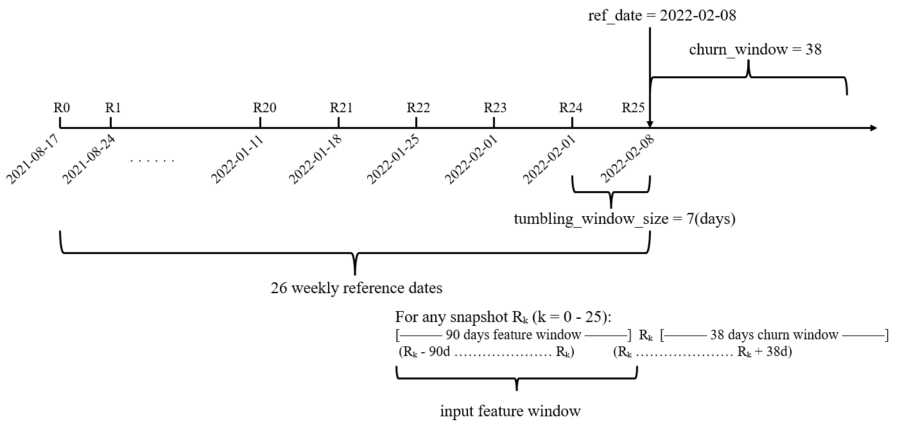

# temporal-churn-prediction

[](#)
[](#)
[](#)

A production‑ready repository for **temporal churn prediction** on retail transactions. The pipeline builds **leak‑free weekly snapshots** in Spark SQL, engineers time‑aware features over a 90‑day lookback, and trains calibrated classifiers to produce two weekly outputs:  
1) an **unbiased churn‑rate forecast** (mean probability), and  
2) an **actionable retention list** using the **F1‑optimal threshold**.

> Full run instructions and environment details are in the **Technical Guide** (see `technical_guide.md`).

## Temporal framing


- **Lookback:** 90 days of behavior  
- **Label window:** 38 days forward (churn = no purchase)  
- **Snapshots:** 26 weekly reference dates (7‑day tumbling); features look **back**, labels look **forward**

## Data & scope
- Spark tables: `customers`, `receipts`, `receipt_lines`, `products`, `stores` (cleaned views used where needed).
- Target: binary **churn_flag** at each snapshot.
- Active set: customers with ≥1 purchase in the prior 38 days.

## Feature groups (SQL‑first)
- **RFM core:** recency; avg spend per visit; monetary signals.
- **Temporal cadence:** tenure; inter‑purchase gaps (avg/std); **recency ratio**; 30‑day **trend**; 4‑week **momentum**; 4‑week **rolling frequency**.
- **Value signal:** **recency‑weighted monetary** (exponential decay).
- **Product behavior:** basket **diversity** (dept/category/subcategory); **avg unit price** (winsorized + log1p).
- **Seasonality:** month/day‑of‑week **sin/cos** encodings.
- **Store context:** primary‑store **lat/lng** (forward‑filled).

> All features are computed **per customer × week** via SQL views and assembled into `final_features` (no label leakage).

## Modeling & validation
- Models: Logistic Regression, Random Forest, XGBoost with **temporal hold‑out** (train → val → final week test).  
- Preprocessing: winsorize + log1p skewed features, standardize on **train only**; class‑weighting for imbalance.  
- Calibration diagnostics: **reliability curves** + **Brier score** (raw vs isotonic vs sigmoid).  
- **Champion:** Random Forest — strong discrimination (ROC‑AUC ≈ **0.94**) and reliable probabilities (Brier ≈ **0.10**).  
- **Backtesting:** rolling weekly forecast with last‑week calibration (Platt). Low mean error (≈ **−0.0003**) and high correlation (≈ **0.785**) indicate temporal stability.

## Quick start
1. Import the notebook to Databricks (**DBR 15.4 LTS ML**).  
2. Ensure the five source tables are available.  
3. Run top‑to‑bottom, weekly outputs include:  
   - `predicted_weekly_churn_rate` (mean probability), and  
   - `retention_flags` at the F1‑optimal threshold.

## Configuration knobs
Edit the notebook constants to adapt to new data/business rules:
```python
churn_window    = 38   # label window (days ahead)
lookback_window = 90   # feature window (days back)
tumbling_window = 7    # weekly snapshots
num_weeks       = 26   # rolling horizon
```

## Notes for reviewers
- Temporal causality is enforced (features ← history; labels → future).  
- Cleaning steps (e.g., line‑item anomaly filter and store‑1 longitude fix) are handled in views and **not repeated here**—see the Technical Guide.  
- The repo delivers both **strategic** and **operational** outputs: honest probability forecasts and thresholded action lists.

---

**Author:** Karthik Rajesh  
**Platform:** Databricks